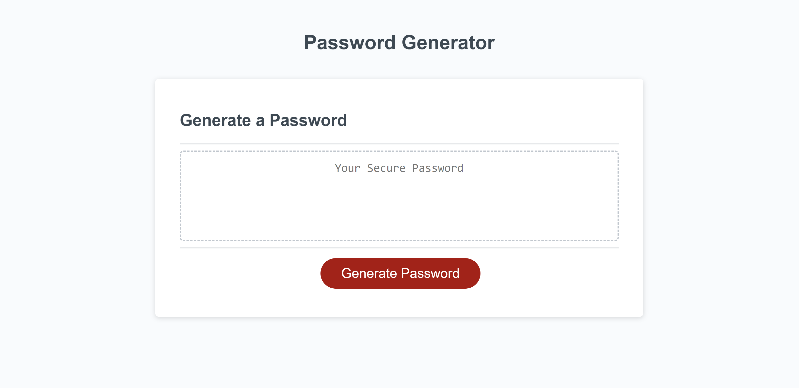

# Password Generator Starter Code

## Description
This project uses Javascript eventlisteners to generate a random password based on user criteria. The user is presented with prompts on how long they want their password and if they would like to include special characters, numbers, uppercase and lowercase letters. After the user confirms criteria, a password is generated by randomizing the user criteria into a string and presented to the user.  

## Installation
- copy github https/ssh link
- git clone to terminal with github https/ssh link

## Usage

https://cjsolis12.github.io/Password_Generator/

## Credits
- TAs Andrea Presto and Zachariah Shone
- https://dev.to/code_mystery/random-password-generator-using-javascript-6a
